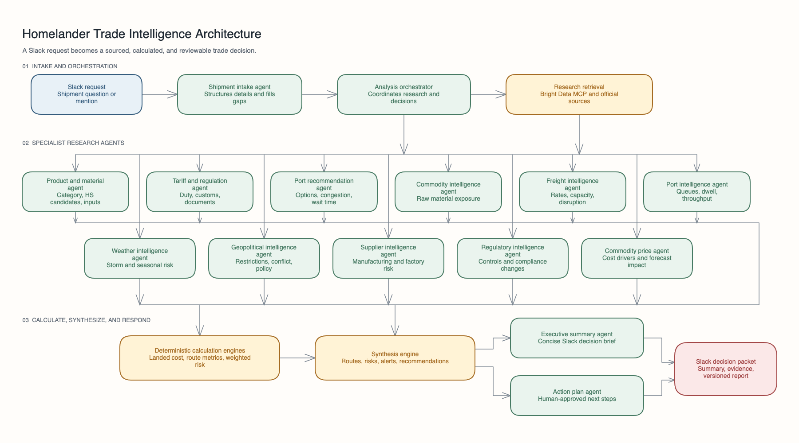

# Homelander

### Trade intelligence for the moment a shipment decision has to be made

Homelander is a Slack-native assistant for international trade and logistics. A team member can ask about a shipment in plain language and receive a practical decision brief covering routes, cost, customs, documents, and risk.

It turns a time-consuming research task into one focused conversation, with the evidence and assumptions needed for a human to make the final call.

## Why we built it

International shipping decisions are rarely difficult because information does not exist. They are difficult because the information is scattered across tariff databases, carrier pages, port updates, regulations, weather reports, and spreadsheets.

Homelander brings those pieces together in the place teams already work: Slack. It helps answer questions like:

| Variable | Required | Default | Description |
|---|---|---|---|
| `PORT` | No | 3000 | HTTP server port |
| `HOMELANDER_MOCK_MODE` | No | false | Force the analysis/report loop to use complete synthetic mock data, even when API keys are configured |
| `HOMELANDER_MOCK_MIN_DURATION_MS` | No | 60000 | Minimum elapsed time for forced mock analysis/report responses |
| `SLACK_BOT_TOKEN` | No | — | Slack bot token |
| `SLACK_SIGNING_SECRET` | No | — | Slack signing secret |
| `OPENAI_API_KEY` | No | — | Any OpenAI-compatible API key |
| `OPENAI_MODEL` | No | gpt-4o-mini | Model name |
| `OPENAI_BASE_URL` | No | — | Any OpenAI-compatible endpoint |
| `OPENAI_MAX_CONCURRENCY` | No | 1 custom / 3 OpenAI | Maximum concurrent model requests |
| `OPENAI_MAX_RETRIES` | No | 3 | Retry attempts for rate limits and transient provider errors |
| `OPENAI_RETRY_BASE_MS` | No | 750 | Initial retry backoff in milliseconds |
| `OPENAI_RETRY_MAX_MS` | No | 8000 | Maximum computed retry backoff in milliseconds |
| `OPENAI_RATE_LIMIT_COOLDOWN_MS` | No | 60000 | Maximum delay honored for provider retry/cooldown signals |
| `BRIGHTDATA_API_TOKEN` | No | — | Bright Data API token |
| `BRIGHTDATA_PRO_MODE` | No | false | Bright Data pro mode |

Without API keys, the app falls back to offline heuristic/mock data where providers are unavailable. Set `HOMELANDER_MOCK_MODE=true` to force the full analysis/report loop into mock mode regardless of configured API keys.

- A simple Slack conversation instead of a complex form.
- Clarifying questions when shipment details are missing.
- Route and mode comparisons for practical alternatives.
- Landed-cost estimates with a transparent breakdown.
- Customs, tariff, and documentation research.
- Risk analysis across freight, ports, weather, regulation, and geopolitics.
- A concise Slack recommendation with supporting evidence.
- A complete PDF report for sharing and review.
- Clear separation between facts, estimates, assumptions, and open questions.

Homelander is designed to support human decisions. It does not make binding legal, customs, tax, or compliance decisions, and it does not book freight or file customs entries.

## How it works



1. The user sends a shipment question in Slack.
2. Homelander structures the request and asks for anything important that is missing.
3. Focused research agents gather relevant evidence from public and official sources.
4. Calculation engines estimate landed cost and compare route metrics.
5. Homelander brings the findings together into a recommendation, risk summary, and action plan.
6. The result is returned in the Slack thread, with a cited report for deeper review.

## Example prompts

- “Compare ocean and air freight for this shipment, including landed cost and transit risk.”
- “What customs documents should we verify before importing this product?”
- “Which route has the lowest expected cost if the destination port is congested?”
- “What are the biggest risks in shipping this product from India to Germany next month?”

## What makes the approach trustworthy

- Research is returned with source URLs and retrieval times when available.
- Official government, tariff, port, carrier, and regulatory sources are preferred.
- Financial calculations are performed in code so the language model does not invent arithmetic.
- Weak or missing information is shown as `Unknown` or `Unavailable` instead of false precision.
- High-impact customs and compliance findings include a human-verification warning.
- Each response can include a temporary evidence file so users can check the claims themselves.

## Hackathon scope

This submission focuses on the core workflow:

- Shipment intake through Slack.
- Clarification and structured extraction.
- Trade and logistics research.
- Deterministic landed-cost calculations.
- Risk analysis and route comparison.
- Cited Slack summaries and PDF reports.

Features such as supplier discovery, freight booking, customs filing, proactive alerts, and automatic route changes are intentionally outside the current scope.

## Try it locally

### Requirements

- Node.js 22 or newer
- npm

### Run

```bash
npm install
cp .env.example .env
npm run dev
```

The project can run in offline mock mode without API keys, using synthetic shipment data for demos. Mock results are for demonstration and are not current trade intelligence.

To connect Slack, create an app, subscribe it to direct messages and `app_mention` events, add the credentials to `.env`, and send a DM to Homelander or mention `@Homelander`.

## Project status

Homelander is an MVP and hackathon prototype. The core analysis flow, Slack interaction, research modules, calculation logic, evidence artifacts, and report generation are implemented in this repository.

- **LIVE** — Real web searches + LLM analysis (requires API keys)
- **MOCK fallback** — Heuristic fallbacks, realistic but not current (no API keys needed)
- **Forced mock loop** — `HOMELANDER_MOCK_MODE=true` bypasses live providers for shipment analysis and returns a complete synthetic report with mock evidence/source labels. Slack intake still collects shipment details, then the final summary waits until at least `HOMELANDER_MOCK_MIN_DURATION_MS` has elapsed so demos do not complete instantly.

## License

MIT
