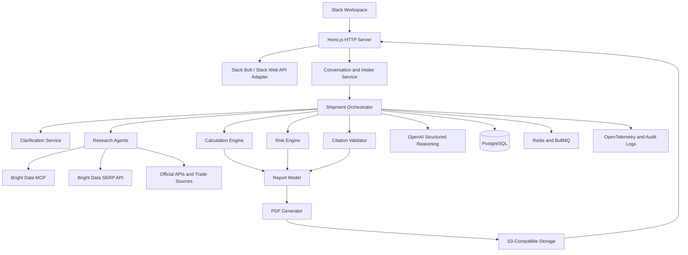

# Transitra — Finalized Technology Stack

## 1. Stack decision

Transitra will use a TypeScript-based application with Slack as the primary interface, Bright Data as the initial public-web retrieval layer, OpenAI for structured reasoning, PostgreSQL for application state, and a dedicated PDF generation service.

The stack is designed for the core product:

- Natural-language shipment intake
- Clarifying questions
- Freight and route research
- Tariff and customs research
- Documentation requirements
- Landed-cost calculations
- Risk analysis
- Cited Slack summaries
- Full PDF reports

Proactive monitoring and alerts are deferred to the later enhancements phase.

Core interaction constraints:

- Transitra responds only to direct messages and explicit `@Transitra` pings.
- Transitra reads only the current Slack thread.
- Transitra does not search workspace history in the core MVP.
- PDF reports are permanently retained and versioned.
- Evidence `.txt` files are temporary, access-controlled, and expire separately from PDFs.

## 2. Recommended stack at a glance

| Layer | Technology | Responsibility |
|---|---|---|
| User interface | Slack | Conversational intake, review, approvals, and report delivery |
| HTTP framework | Hono.js | HTTP routing, Slack webhooks, health checks, and internal routes |
| Slack framework | Slack Bolt for JavaScript / Slack Web API | Events, mentions, commands, modals, buttons, OAuth, and file uploads |
| Application language | TypeScript | End-to-end type safety and maintainable services |
| Runtime | Node.js | API server, orchestration, background jobs, integrations |
| Web retrieval | Bright Data MCP Server | Public-web search, scraping, browser access, and extraction |
| Search fallback | Bright Data SERP API | Structured search results and discovery |
| LLM reasoning | OpenAI API | Intent parsing, clarification, extraction, synthesis, and risk explanations |
| Structured output | OpenAI JSON Schema / structured outputs | Reliable typed model responses |
| Database | PostgreSQL | Workspaces, users, shipments, evidence, reports, and audit records |
| ORM/query layer | Drizzle ORM | Typed database access and migrations |
| Cache and jobs | Redis + BullMQ | Conversation state, rate limiting, retries, and asynchronous work |
| PDF generation | Playwright or PDFKit | Full shipment-analysis reports |
| Object storage | S3-compatible storage | PDF files and controlled report downloads |
| Evidence artifacts | S3-compatible storage + signed URLs | Temporary per-response `.txt` proof files |
| API validation | Zod | Runtime validation at every external boundary |
| Observability | OpenTelemetry + structured logs | Tracing, latency, tool calls, errors, and auditability |
| Testing | Vitest + Playwright | Unit, integration, PDF, and end-to-end tests |
| Deployment | Docker on a managed container platform | Reproducible production deployment |
| CI/CD | GitHub Actions | Tests, linting, type checks, builds, and deployment |

## 3. System architecture



## 4. Slack layer

### Technology

Use **Hono.js on Node.js** as Transitra's HTTP framework, with Slack Bolt for JavaScript or the Slack Web API integrated behind Hono routes.

Hono owns the HTTP surface. Slack Bolt owns Slack-specific event parsing and interaction helpers. This keeps the server lightweight while avoiding custom implementations of Slack signature validation, event payload handling, modals, and interactive actions.

Recommended routes:

```text
Hono server
  ├── /slack/events       → Slack event receiver
  ├── /slack/interactions → Slack actions and modal submissions
  ├── /slack/oauth        → Slack installation flow
  ├── /health             → health check
  └── /internal/...       → authenticated internal routes
```

### Responsibilities

- Receive direct messages.
- Receive `@Transitra` mentions.
- Process thread context.
- Open modals for structured shipment details.
- Post progress updates.
- Render route cards and risk summaries.
- Attach PDF reports.
- Handle interactive buttons.
- Support app installation through OAuth.

### Primary Slack entry points

1. Direct message with Transitra.
2. `@Transitra` mention in a channel.
3. `@Transitra` mention inside a shipment thread.
4. “Analyze shipment” shortcut.
5. App Home tab for saved shipment profiles and reports.

### Slack interaction rules

- Reply in the originating thread by default.
- Do not expose private context in a public channel.
- Show progress for long-running research.
- Require confirmation before external or consequential actions.
- Use synthetic data in the developer demo workspace.

## 5. Application services

### 5.1 Slack adapter

Translates Slack events into internal commands and internal results into Slack messages.

Suggested modules:

```text
src/slack/
  app.ts
  events.ts
  commands.ts
  mentions.ts
  modals.ts
  actions.ts
  messages.ts
  files.ts
  oauth.ts
```

### 5.2 Conversation and intake service

Responsibilities:

- Maintain conversation state.
- Extract shipment details from natural language.
- Identify missing inputs.
- Ask the highest-value clarifying questions.
- Merge user answers into the shipment object.

### 5.3 Shipment orchestrator

Coordinates the full analysis:

```text
Validate input
  → Ask missing questions
  → Run research modules
  → Normalize evidence
  → Calculate costs
  → Analyze risks
  → Validate citations
  → Synthesize recommendation
  → Generate Slack summary and PDF
```

### 5.4 Research services

Research services should be separate modules, not one unrestricted agent.

Recommended modules:

- Product and classification research
- Freight and route research
- Customs and tariff research
- Documentation research
- Port and disruption research
- Weather research
- Geopolitical research

Each module should return typed evidence rather than unstructured prose.

### 5.5 Calculation engine

The calculation engine must be deterministic and independent of the LLM.

It calculates:

- Product value
- Origin inland transport
- Export handling
- Freight
- Insurance
- Duties
- Import taxes
- Brokerage
- Port fees
- Destination transport
- Storage and handling
- Currency conversion
- Per-unit landed cost

The LLM may explain the calculation, but TypeScript code performs the arithmetic.

### 5.6 Risk engine

The risk engine combines structured evidence with model reasoning to classify:

- Customs risk
- Documentation risk
- Classification risk
- Route and carrier risk
- Port risk
- Weather risk
- Geopolitical risk
- Cost volatility
- Delivery timing risk
- Data-quality risk

Every risk must link to evidence and include confidence.

### 5.7 Report service

The report service creates:

- Slack summary
- Full PDF report
- Report metadata
- Version history
- Evidence appendix

The PDF must use the same structured report model as the Slack summary so the two outputs cannot silently disagree.

## 6. AI and reasoning layer

### Technology

Use the OpenAI API with structured outputs and JSON Schema-compatible response formats.

### Appropriate model responsibilities

Use the model for:

- Intent detection
- Shipment-field extraction
- Clarifying-question generation
- Search-query generation
- Evidence summarization
- Risk explanation
- Recommendation synthesis
- Natural-language Slack responses

Do not use the model as the final authority for:

- Financial arithmetic
- Tariff arithmetic
- Currency conversion
- Source timestamps
- Citation URLs
- Permission decisions
- Report versioning

### Model output rule

Every major model call must return a validated schema. Invalid output must be rejected, repaired, or retried rather than passed to the next stage unchecked.

## 7. Web and trade-data layer

### Primary provider: Bright Data

Bright Data MCP is the initial public-web retrieval provider. It supports:

- Search
- Web-page extraction
- Dynamic pages
- Browser automation
- Structured extraction
- Public PDFs and government portals
- MCP-based agent access

Bright Data SERP API can be used for structured search discovery.

### Source authority model

Bright Data retrieves information; it does not make the retrieved information authoritative.

Source priority:

1. Government customs and trade agencies.
2. Official tariff databases.
3. Official port authorities.
4. Official carriers and logistics operators.
5. Regulatory and standards organizations.
6. Established industry publications.
7. Secondary sources for discovery only.

### Provider abstraction

Keep the provider replaceable:

```typescript
export interface WebResearchProvider {
  search(input: SearchRequest): Promise<SearchResult[]>;
  fetch(url: string): Promise<SourceDocument>;
  extract<T>(
    document: SourceDocument,
    schema: ExtractionSchema<T>
  ): Promise<T>;
}
```

This allows future additions such as Apify, Tavily, Exa, or official trade APIs without rewriting the agent layer.

### Future data supplements

Bright Data should be supplemented—not necessarily replaced—with:

- Official tariff APIs
- Customs APIs
- Port APIs
- Carrier quote APIs
- Vessel-tracking APIs
- Currency APIs
- Weather APIs

These should be added only when a real coverage gap is identified.

## 8. Database

### Technology

Use PostgreSQL with Drizzle ORM.

### Core tables

```text
workspaces
workspace_users
slack_installations
conversations
shipments
shipment_inputs
shipment_assumptions
research_runs
evidence
route_options
cost_estimates
risks
reports
report_versions
audit_events
```

### Important data rules

- Every shipment analysis receives a unique ID.
- Every report is versioned.
- Evidence is stored with retrieval timestamps.
- User-provided facts are distinct from external facts.
- Assumptions are never silently overwritten.
- Private Slack content is scoped to workspace and channel permissions.
- Raw sensitive content is not stored unless required for auditability.

## 9. Background jobs and state

### Technology

Use Redis with BullMQ for asynchronous work.

### Jobs

- Long-running shipment analysis
- Bright Data retrieval retries
- PDF generation
- Report upload
- Cleanup of expired report files
- Optional future monitoring jobs

### Job properties

Each job should have:

- Job ID
- Shipment ID
- Workspace ID
- Status
- Attempt count
- Start time
- End time
- Error state
- Retry policy

The current core product does not require recurring monitoring jobs. The queue layer is still useful for long-running research and PDF generation.

## 10. PDF generation

### Recommended technology

Use **Playwright** to render a print-optimized HTML report to PDF.

### Why Playwright

- Strong HTML/CSS support.
- Reusable web report templates.
- Good tables and page layout.
- Easier visual iteration than drawing every element manually.
- Can be tested with screenshot and PDF comparisons.

### PDF sections

- Executive summary
- Shipment inputs
- Assumptions
- Route comparison
- Landed-cost calculation
- Customs and tariff findings
- Documentation checklist
- Risk analysis
- Evidence and citations
- Open questions
- Next actions
- Confidence and limitations
- Disclaimer

## 11. Storage and report delivery

### Technology

Use S3-compatible object storage for generated PDFs.

Possible providers:

- AWS S3
- Cloudflare R2
- Google Cloud Storage
- Azure Blob Storage

### Storage rules

- Store reports under workspace and report IDs.
- Do not expose public bucket URLs.
- Use short-lived signed download URLs where possible.
- Apply retention and deletion policies.
- Record report version and source evidence references.

## 12. Security and permissions

### Slack security

- Use least-privilege OAuth scopes.
- Verify Slack request signatures.
- Encrypt bot tokens and signing secrets.
- Scope conversation retrieval to authorized channels.
- Do not copy private context into public channels.

### Application security

- Validate every external input with Zod.
- Protect internal endpoints with authentication.
- Apply workspace-level data isolation.
- Redact secrets and sensitive content from logs.
- Add rate limits per workspace and user.
- Store audit events for tool calls and report creation.

### AI security

- Treat scraped content as untrusted input.
- Defend against prompt injection in public pages and PDFs.
- Keep retrieved content separate from system instructions.
- Require citations for high-impact claims.
- Do not allow retrieved webpages to invoke arbitrary tools.
- Require human review for high-risk recommendations.

## 13. Observability

### Technologies

- OpenTelemetry for traces.
- Structured JSON logs.
- Error tracking such as Sentry.
- Metrics backend such as Prometheus-compatible monitoring.

### Required traces

Trace each analysis through:

```text
Slack event
  → intake parsing
  → clarification
  → research calls
  → evidence normalization
  → calculation
  → risk analysis
  → citation validation
  → PDF generation
  → Slack delivery
```

Track:

- Total analysis latency.
- Latency by agent.
- Bright Data failures.
- Model failures.
- Invalid structured outputs.
- Citation validation failures.
- Calculation errors.
- PDF generation errors.
- Slack delivery failures.

## 14. Testing stack

### Unit tests — Vitest

Test:

- Cost calculations.
- Currency conversion.
- Input parsing.
- Missing-field detection.
- Risk classification.
- Confidence rules.
- Citation validation.
- Permission filtering.

### Integration tests

Test:

- Bright Data adapter with mocked responses.
- OpenAI structured outputs with fixtures.
- PostgreSQL repositories.
- Redis jobs.
- PDF generation.
- Slack message rendering.

### End-to-end tests — Playwright

Test:

- Complete shipment analysis.
- Clarification conversation.
- Slack summary rendering.
- PDF file creation.
- PDF visual layout.
- Failure and retry paths.

### Evaluation dataset

Maintain fixtures for:

- China → United States furniture.
- India → Europe electronics.
- Mexico → United States machinery.
- Food or regulated goods.
- Missing shipment details.
- Conflicting sources.
- Stale sources.
- Restricted products.

## 15. Deployment

### Recommended deployment shape

```text
Managed container service
    ├── Transitra API and Slack listener
    ├── Worker process
    └── PDF worker

Managed PostgreSQL
Managed Redis
S3-compatible report storage
Bright Data MCP
OpenAI API
```

### Container requirements

- Node.js LTS runtime.
- Playwright browser dependencies.
- Non-root container user.
- Health check endpoint.
- Graceful shutdown.
- Separate web and worker processes.

### Environments

- Local development.
- Test environment.
- Slack developer sandbox.
- Staging.
- Production.

## 16. Environment variables

```text
NODE_ENV
PORT
DATABASE_URL
REDIS_URL
OPENAI_API_KEY
OPENAI_MODEL
BRIGHTDATA_API_TOKEN
SLACK_CLIENT_ID
SLACK_CLIENT_SECRET
SLACK_SIGNING_SECRET
SLACK_STATE_SECRET
OBJECT_STORAGE_ENDPOINT
OBJECT_STORAGE_BUCKET
OBJECT_STORAGE_ACCESS_KEY
OBJECT_STORAGE_SECRET_KEY
SENTRY_DSN
```

Secrets must be stored in a managed secrets system outside local source control.

## 17. Current MVP versus later additions

### Core MVP

- Slack DM and mentions.
- Natural-language shipment intake.
- Clarifying questions.
- Bright Data public-web research.
- Trade and customs evidence.
- Route comparison.
- Deterministic landed-cost estimates.
- Risk analysis.
- Citations.
- Slack summary.
- PDF report.
- Human approval for actions.

### Later enhancements

- Proactive trade-lane monitoring.
- Semantic change detection.
- Automatic regulatory alerts.
- Port and carrier disruption alerts.
- Relevance matching to saved shipments.
- Updated PDF reports after detected changes.
- Official customs and freight APIs.
- ERP and TMS integrations.
- Slack Connect workflows with external logistics partners.

## 18. Final recommendation

Start with a modular TypeScript monolith rather than microservices:

```text
Hono.js + Slack Bolt + TypeScript
        ↓
Single orchestrator
        ↓
Typed research modules
        ↓
Bright Data MCP adapter
        ↓
Deterministic calculation engine
        ↓
Risk and citation validation
        ↓
Slack summary + Playwright PDF
```

Split the worker and PDF generation processes only when workload or reliability requires it. Keep all providers behind interfaces so Bright Data, model providers, and official data APIs can evolve without changing Transitra’s product logic.
